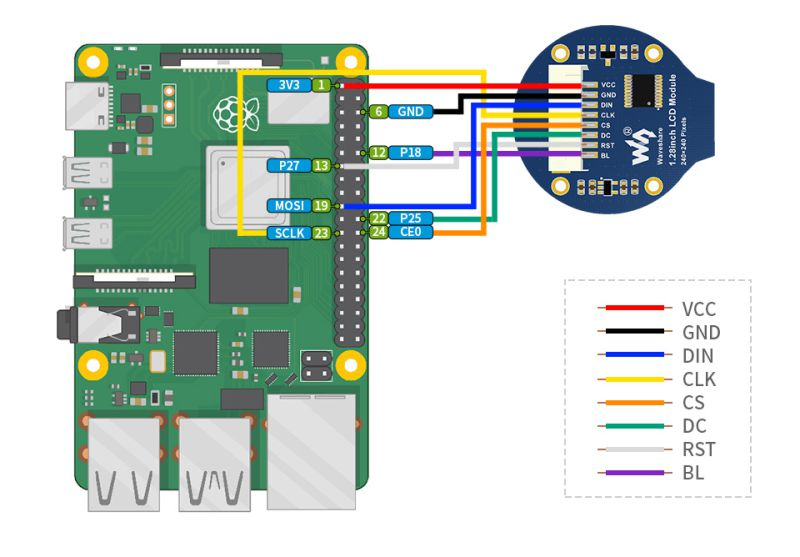

# Waveshare 1.28inch LCD Module animated eyes powered by RaspberryPi 3B+

**Ubuntu Server 22.10 (32bit) on RaspberryPi 3B+**

You can check the steps on [raspberrypi-france.fr](https://www.raspberrypi-france.fr/lancer-un-script-python-au-demarrage-du-raspberry-pi/) to launch the soft automaticly when Raspberry Pi started.

**Basic information**

You can easly run the program with the command below :

```
sudo apt-get update
sudo apt-get install python3-pip
sudo apt-get install python3-pil
sudo apt-get install python3-numpy
sudo pip3 install spidev
sudo pip3 install RPi.GPIO
sudo apt-get install python3-rpi.gpio
sudo python3 animatedEyes.py
```

**Pin connection**



ATTENTION : COULEUR DES CABLES INVERSES DANS MON CAS !!!

activer SPI1 dans le fichier /boot/config.txt en ajoutant la ligne suivante : `dtoverlay=spi1-3cs`
```
echo "dtoverlay=spi1-3cs" | sudo tee -a /boot/config.txt
sudo reboot
```
Cela activera SPI1 avec jusqu'à trois Chip Selects (CS1, CS2, CS3). 

Le câblage pour le deuxième écran sera similaire à celui du premier, mais en utilisant les broches dédiées à SPI1 :
- VCC : 5V
- GND : GND
- DIN (MOSI) : Pin 38 (SPI1 MOSI)
- CLK (SCLK) : Pin 40 (SPI1 SCLK)
- CS (Chip Select) : Pin 36 (SPI1 CE0)
- DC : GPIO 35 (choisir un GPIO libre)
- RST : GPIO 33 (choisir un GPIO libre)
- BL : GPIO 31 (Autre GPIO libre pour le rétroéclairage.)
